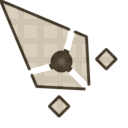
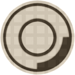
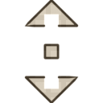
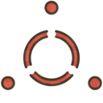

# NieR Style Cursors
Uses Blender 2.82+, xcursorgen, imagemagick, and of course common bash tools like `bc`. Building for windows also needs Python 3.
*Possibly* runs on blender versions as old as 2.80. Windows builds currently don't support animation.

Now has prebuilt release archives bundled!
## Preview Images
renditions updated when you run ./build.sh before committing.
idk how thisll look online maybe it should be one big image don't feel like writing the code to make an imagemagick grid right now.

---

Adwaita is a fallback for those not included. This can be changed in the "index.theme" file present in the built theme.

## "Cool how do I yes?"

1. have the tools installed
2. download the thing
3. run the `build.sh` file
4. a folder will appear called 'icons' that has the theme inside. up to your distro gods what to do with the generated theme.

### Installation of prebuilt themes

 - Linux: Unpack the archive and put the folder in your user icons folder (usually `~/.icons/`), then pick the cursor theme with whatever desktop/theme manager you use.
 - Windows: Unpack the archive, right-click 'install.inf', and select 'install'. Right now, not every cursor has a windows equivalent, so when the dialogue box shows up complaining about "File not found", just close it and move on. Finally, go to control-panel -> mouse -> pointers and select "NieR Cursors" as your theme.

## F.A.Q.
Question|Answer
---|---
Why does .build.sh take years?|60fps animations. Smoother than a well-oiled Adam. Strongly recommend using a workstation or gaming pc.
Some cursors look 'off'. Ex: Default arrow.|They're mathematically perfect, not optically/perceptually perfect. Accounting for the distortion of dumb human brains takes more effort than I'm willing to put in right now.
Why Blender? Inkscape or Illustrator would do this and that and everything better|Inkscape 0.9X straight doesn't support the cursor workflow of sharing assets and non-destructive modification. Inkscape 1.0 beta *does* but also eats my fukken soul every time it crashes or hangs, which is a lot. So much so that if I had $100 for every time I lost changes in Inkscape beta I would be well on my way to taking that computer science class I can't afford. Ergo, Illustrator is also out of the picture cause expensive proprietary biz. Blender with it's new Eevee render is a swiss army knife of artwork and has only crashed like 4 times so far so overall it has a Crash-Per-Session (CPS)[not related] rate improvement of a few thousand percent over Inkscape beta. There's an unmaintained Inkscape branch in this git repo if you *still* don't believe me, where I initially made the cursor and loading circle.
