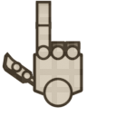

# NieR Style Cursors

Adwaita is a fallback for those not included. This can be changed in the "index.theme" file present in the built theme.

## Installing
Download the [release](https://github.com/Beinsezii/NieR-Cursors/releases) archive for your operating system
 - Linux: Unpack the archive and put the folder in your user icons folder (usually `~/.icons/`), then pick the cursor theme with whatever desktop/theme manager you use.
 - Windows: Unzip the archive somewhere then right-click 'install.inf' and select 'install'. Right now, not every cursor has a windows equivalent, so when the dialogue box shows up complaining about "File not found", just close it and move on. Finally, go to control-panel -> mouse -> pointers and select "NieR Cursors" as your theme.

## Building From Source
 1. Have Python, Bash, XCursorgen, ImageMagick Blender 2.83+ installed
 2. Clone the repository
 3. Run `build.sh` file
 4. A folder will appear called 'icons' that has the Linux and Windows themes inside.

## State
 + Cursors for every type of mouse event I come across
 + Many sizes ensure crisp HiDPI
 - Windows is missing animations
 - No handwriting/pen cursor

## F.A.Q.
Question|Answer
---|---
Why Blender? Inkscape or Illustrator would do this and that and everything better|Inkscape 0.9X doesn't support the cursor workflow of sharing assets and non-destructive modification. Inkscape 1.0 beta *does* but if I had $100 for every time it crashed or hanged I would be well on my way to taking that computer science class I can't afford. Blender with it's new Eevee render is a swiss army knife of artwork and has only crashed like 4 times so far overall so it's hundreds of times more stable. There's an unmaintained Inkscape branch in this git repo for the brave and curious.
